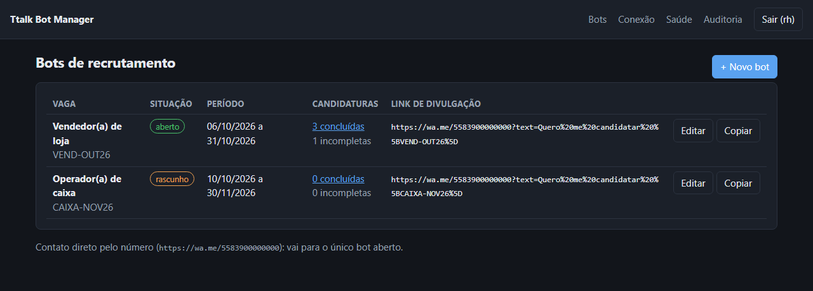
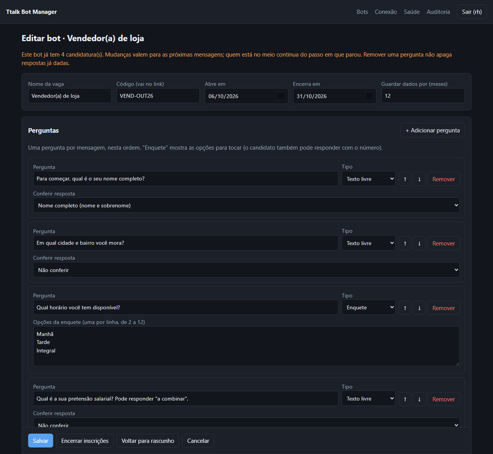
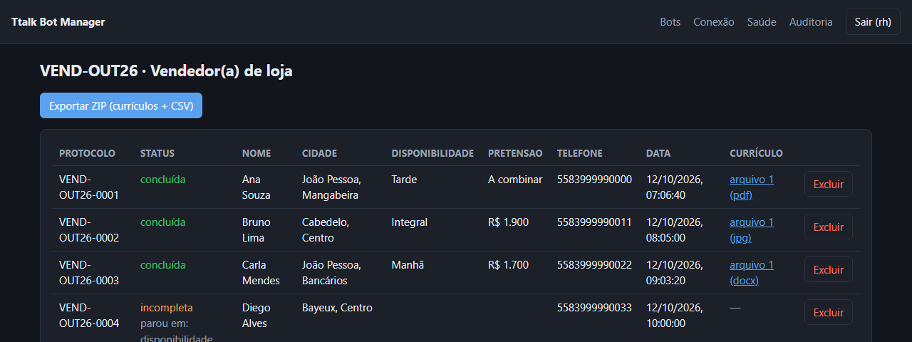
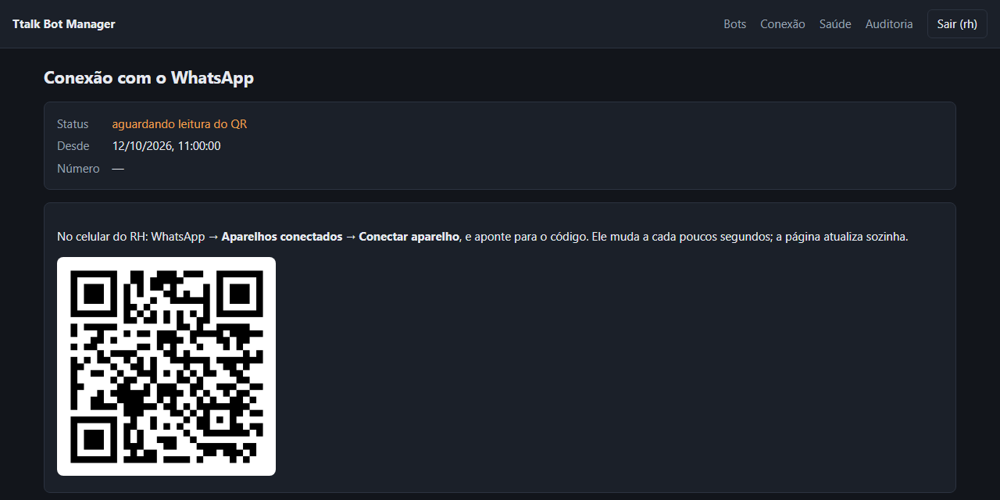
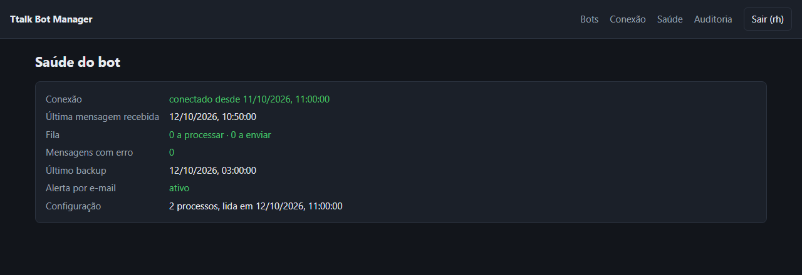
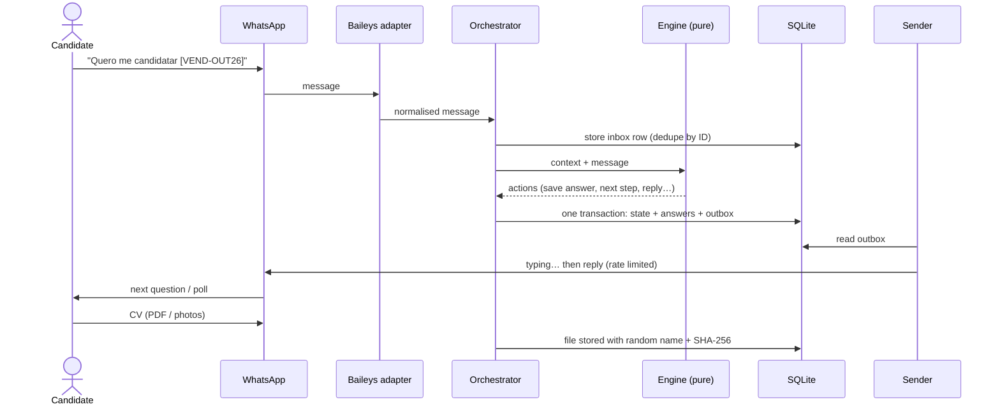

<div align="center">

# Ttalk Bot Manager

**Self-hosted WhatsApp bots that wait for the first message, ask a few questions, collect a file and keep it safe on your own server.**

Built for recruitment (candidate → questions → CV), designed to be reused for every new opening without touching code.

[](https://github.com/GustavoHuds/Ttalk_bot_manager/actions/workflows/ci.yml)
[](LICENSE)


[Português](README.pt-BR.md) · [Quick start](#quick-start) · [How it works](#how-it-works) · [Security](#security-and-privacy)



</div>

---

## Why

Hiring through WhatsApp usually means a person copying names from chats and digging CVs out of a phone gallery. Off-the-shelf WhatsApp gateways solve the connection but leave you to build the conversation, the storage and the privacy rules yourself.

Ttalk is the whole thing in one small process: one WhatsApp number, as many bots as you have openings, a web panel to create them, and a vault for what candidates send. No browser, no Redis, no PostgreSQL.

## Features

**Conversation**
- Waits for the person to write first: never starts a conversation.
- One question per message: free text (with optional full-name or phone validation) or a native WhatsApp **poll**. Typed answers like `2` or `manhã` also work.
- Ends by collecting a file: **PDF, DOCX or photos**. Multi-page photos are grouped (60 s after the last one).
- Sent the CV first? It is kept and the questions continue; nothing is lost.
- Handles real-world mess: audio and stickers, wrong formats, oversize files, coming back after 24 h, replacing a CV later, and hidden numbers (WhatsApp `@lid` IDs). When the number is hidden it asks for a phone.
- Entry by `wa.me` link with the opening's code, or by writing straight to the number. With several openings, the person picks one in a poll.

**Admin panel**
- **Create, edit, copy, open and close bots** in the browser. Changes apply instantly, with no restart.
- Candidate list per opening, file download, **ZIP export (CSV + files)** ready for AI screening.
- Connection page with QR code, health page, full audit log (who viewed, downloaded, exported or deleted what).

**Reliability** (the guarantees you would get from the official API)

| Official Cloud API guarantee | How Ttalk reproduces it |
| --- | --- |
| A webhook is never processed twice | Every message ID is stored; duplicates are dropped |
| No message is lost | Messages are written to SQLite *before* processing; pending ones are retried after a crash |
| Replies are consistent with state | Replies go to an **outbox written in the same transaction** as the state change |
| Media can always be downloaded | Download retries plus media re-upload request when the link expires |
| Account status is visible | `/saude` page and a data-free `/healthz` for uptime monitors |

**Anti-ban behaviour**: reply-only, read receipts, "typing…" for 1 to 4 s scaled to message length, at least 1.5 s between messages per chat, 20 per minute overall, randomised greeting variants, never shown as permanently online, no history sync, exponential reconnect backoff, and a full stop on logout instead of hammering.

## Screenshots

| Bot editor | Candidates |
| --- | --- |
|  |  |
| **Connection (QR)** | **Health** |
|  |  |

*Screenshots use fictional demo data (`npm run capturas`).*

## How it works



```
src/
├── conversa/     engine (pure rules) + orchestrator (inbox → engine → transaction → outbox)
├── whatsapp/     Baileys adapter (the only Baileys-aware code), sender with human pacing, message normaliser
├── config/       bots stored in SQLite, validation shared by panel and engine
├── painel/       Fastify panel: auth, bot editor, candidates, export, connection, health, audit
├── rotinas/      retention, encrypted backup, e-mail alerts
└── db/           schema migrations and repository
```

- **The engine never talks to WhatsApp or the database.** It returns a list of actions, so every conversation path is unit-tested without a phone.
- **The adapter is swappable.** Moving to Evolution API or Meta's official Cloud API means writing one class with the same five methods; the flow stays untouched.

## Quick start

Requirements: Docker (or Node.js 22), and a WhatsApp number dedicated to the bot.

```bash
git clone https://github.com/GustavoHuds/Ttalk_bot_manager.git
cd Ttalk_bot_manager
cp .env.example .env

# 1. secret for the session cookie
node -e "console.log(require('crypto').randomBytes(32).toString('hex'))"   # → PAINEL_SEGREDO
# 2. panel user (prints a line for PAINEL_USUARIOS)
npm install && npm run senha -- admin
# 3. your company name, used as {empresa} in messages
#    EMPRESA_NOME=Acme Ltda

mkdir -p data && sudo chown 1000:1000 data   # the container runs as uid 1000
docker compose up -d --build
```

Open `http://127.0.0.1:3100`, sign in, go to **Conexão** and scan the QR code with WhatsApp → *Linked devices*. Then **+ Novo bot**, fill in the opening, **Abrir inscrições**, and share the link shown in the list.

In production, publish the panel behind your reverse proxy with HTTPS:

```caddyfile
bots.example.com {
    reverse_proxy 127.0.0.1:3100
}
```

<details>
<summary>Run without Docker</summary>

```bash
npm install
npm run dev          # watch mode, panel on http://127.0.0.1:3100 (set PAINEL_COOKIE_SEGURO=false without HTTPS)
npm run build && npm start
```
</details>

## Configuration

| Variable | Default | Purpose |
| --- | --- | --- |
| `EMPRESA_NOME` | `nossa empresa` | Company name, available as `{empresa}` in every message |
| `PAINEL_SEGREDO` | required | ≥ 32 chars, signs the session cookie |
| `PAINEL_USUARIOS` | required | `name:hash;name2:hash2`, generate with `npm run senha -- name` |
| `PAINEL_HOST` / `PAINEL_PORTA` | `127.0.0.1` / `3100` | Panel bind address |
| `PAINEL_COOKIE_SEGURO` | `true` | Secure cookie (HTTPS); `false` only for local testing |
| `JANELA_RESPOSTA_HORAS` | `24` | Only reply to messages received within this window |
| `BACKUP_SENHA` | empty (off) | Enables the encrypted daily backup |
| `BACKUP_RETENCAO_DIAS` | `365` | How long backups are kept |
| `SMTP_URL`, `ALERTA_EMAIL_DE`, `ALERTA_EMAIL_PARA` | empty (off) | E-mail alerts: connection down > 10 min, logout, recovery, failed backup |
| `DADOS_DIR` / `CONFIG_DIR` | `./data` / `./config` | Data vault and factory texts |
| `LOG_NIVEL` | `info` | pino log level |

Factory texts live in [`config/mensagens-padrao.yaml`](config/mensagens-padrao.yaml). Each bot can override any of them in the panel. Variables: `{empresa}`, `{vaga}`, `{primeiro_nome}`, `{protocolo}`, `{retencao_meses}`.

## Security and privacy

Built with Brazil's LGPD in mind (it maps well to GDPR):

- **Purpose and retention are stated up front** in the first message, not a vague "your data is protected".
- **Minimum data**: only what each bot asks for.
- **Self-service erasure**: the candidate writes *"excluir meus dados"* and confirms with *SIM*. Everything linked to that number is erased, and only the date of the erasure is logged.
- **Automatic retention**: a daily job deletes each opening's data after its retention period.
- **Files outside any public folder**, with random names. The candidate's name lives only in the database. File signatures are checked, so a fake `cv.pdf` is rejected.
- **Panel** behind login (scrypt hashes, signed `HttpOnly` + `SameSite=Strict` cookie, lockout after 5 failures). Every view, download, export and deletion is audited.
- **Encrypted daily backup** (AES-256-GCM, scrypt-derived key) of database, files and session.
- **Logs carry IDs only**, never message content or personal data. CSV export neutralises spreadsheet formula injection.

See [SECURITY.md](SECURITY.md) to report a vulnerability.

## Testing

```bash
npm test          # 90 tests: engine, full flows on SQLite, sender pacing, panel, editor UI (jsdom), backup, retention
npm run typecheck
```

CI runs typecheck, tests and the Docker build on every push.

## FAQ

**Will my number get banned?**
The main ban trigger is starting conversations in bulk, and Ttalk never does that: it only replies, with human pacing. Risk is low but never zero with any unofficial connection. Use a dedicated, warmed-up number with a complete WhatsApp Business profile, and keep a spare SIM.

**Why Baileys and not whatsapp-web.js or Evolution API?**
Baileys speaks the WhatsApp Web protocol over a WebSocket with no browser, so it is light enough to share a small VPS. Evolution API is great for many numbers but adds PostgreSQL and Redis and, from 2.4, a licence check. The adapter layer keeps the door open to any of them, or to the official Cloud API.

**Do poll answers work on Baileys 7?**
Baileys 7 no longer decrypts poll votes by itself. Ttalk stores each poll's secret and decrypts votes in the adapter. If a device ever fails, typing the option number works too.

**Can I use it for something other than recruitment?**
Yes. Any "ask a few questions, then receive a file" flow fits: registrations, document collection, warranty claims.

## Roadmap

- [ ] AI screening of exported CVs (OCR for photos)
- [ ] Telegram alerts
- [ ] Optional official Cloud API adapter
- [ ] Per-source link tracking (Instagram, job boards, store posters)

## Contributing

Issues and pull requests are welcome. Read [CONTRIBUTING.md](CONTRIBUTING.md) first.

## Disclaimer

Ttalk is not affiliated with, endorsed by or connected to WhatsApp or Meta. It uses an unofficial connection; you are responsible for complying with WhatsApp's terms and with privacy law in your country.

## License

[MIT](LICENSE) © 2026 Gustavo Hudson
