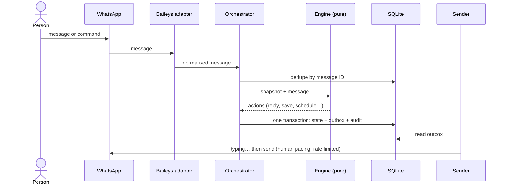

<div align="center">

# Ttalk Bot Manager

**Self-hosted WhatsApp bots for small businesses: a recruitment bot that collects CVs, and a group bot that runs your company groups — managed from one web panel on your own server.**

[](https://github.com/GustavoHuds/Ttalk_bot_manager/actions/workflows/ci.yml)
[](LICENSE)


[Português](README.pt-BR.md) · [Quick start](#quick-start) · [Group bot commands](#group-bot-commands) · [Staying under the radar](#staying-under-the-radar) · [Security](#security-and-privacy)


</div>

---

## Why

Small companies run on WhatsApp. Hiring means someone copying names from chats and digging CVs out of a phone gallery; managing a dozen store groups means someone pinging everyone by hand, reposting the same reminder every morning and deleting scam messages at midnight.

Off-the-shelf gateways give you a connection and leave the rest to you. Ttalk is the whole thing in **one small Node.js process**: several WhatsApp numbers, as many bots as you need, a web panel to run them, and a vault for what people send. No browser, no Redis, no PostgreSQL — just SQLite.

## Two kinds of bot

### Recruitment bots

One bot per job opening, created in the panel without touching code.

- **Waits for the candidate to write first** — it never starts a conversation.
- One question per message: free text (with optional full-name or phone validation) or a native **WhatsApp poll**. Typed answers like `2` or `manhã` work too.
- Ends by collecting a **PDF, DOCX or photos**; multi-page photos are grouped. A CV sent too early is kept, not lost.
- Handles real life: audio and stickers, wrong formats, oversize files, coming back a day later, replacing a CV, and hidden numbers (`@lid`).
- Entry by a `wa.me` link carrying the opening's code, or by writing to the number directly (with several openings, the candidate picks one in a poll).
- Candidate list, file download and **ZIP export (CSV + files)** ready for screening.

### Group bots

One bot runs the company groups you choose, from the group itself or from a private chat with it.

- **Acts only in groups you activate.** Everywhere else it is silent and stores nothing.
- **Managers are the only people registered.** Add a name and a WhatsApp number; the person gets power only after sending a 6-digit code (`/confirmar`) from that exact WhatsApp. A code from a different number is held for you to check.
- **Commands work in the group and in private.** In private, the bot asks which group (numbered list), runs the command there and remembers the choice for the next ones.
- **Scheduled messages** per group: weekdays or a single date, up to four times a day, up to **three message variations** (picked at random, never the same twice in a row), images, video, audio or documents, and an optional hidden mention of everyone.
- **Moderation**: banned words are deleted automatically, the group can be closed now or every night on a schedule, and members can be removed by command.
- Each command can be switched off per bot.

<div align="center">

</div>

## Group bot commands

All commands are for confirmed managers; anyone else gets no reply.

| Command | In a group | In private (the bot asks which group) |
| --- | --- | --- |
| `/all message` | Posts the message mentioning everyone **without showing the mentions**, and deletes the manager's command | Posts it in the chosen group; attach a photo or video and it goes along |
| `/todos message` | Same, with every `@mention` visible in the text | Same, in the chosen group |
| `/mencionar message @person` | Posts the message mentioning that person silently | Use the person's phone number instead of `@` |
| `/remove @person …` | Removes members (never group admins) | Phone numbers instead of `@` |
| `/banword word, other` | Messages containing those words are deleted. `/banword` lists, `/banword remover x` removes, `/banword limpar` clears | Same, for the chosen group |
| `/mutegroup` · `/mutegroup 22:00/06:00` | Closes the group (only admins can write) until `/unmute`, or every day in that window | Same |
| `/unmute` | Opens the group and clears the schedule | Same |
| `/repeat 08:00 18:30` | Reply to (quote) any message — text or media — and the bot reposts it every day at those times. Plain `/repeat` asks for the message; `/repeat stop` stops | Same |
| `/menu` · `/grupo` | Lists the commands | `/grupo` picks a different group |

Removing members, closing the group and deleting messages require the bot's number to be a group admin; the bot tells you when it isn't. Mentions work either way.

## Panel

A clean, responsive panel (sidebar on desktop, menu on phones) in Portuguese.

| Group bot · scheduled message | Group bot · managers |
| --- | --- |
|  |  |
| **Recruitment bot editor** | **Candidates** |
|  |  |
| **Number (QR pairing)** | **On a phone** |
|  |  |

*Screenshots use fictional demo data (`npm run capturas`, `npx tsx scripts/previa-painel.ts`).*

- **Numbers**: each number has one role — *recruitment* or *groups* — so a ban on one never touches the other. A number can be **paused** (stays connected, the bot stops reading and sending) or **revoked** (the linked WhatsApp is logged out and a fresh QR appears). The QR only runs while its page is open.
- **Health** page, a data-free `/healthz` for uptime monitors, and a full **audit log** (who viewed, exported, changed or deleted what).

## Staying under the radar

WhatsApp bans numbers for *patterns*, not single actions. Ttalk follows what long-running tools (Evolution API, WPPConnect, whatsapp-web.js, the Baileys guides) converge on:

- **Never starts a conversation** — the biggest ban trigger by far.
- **"Typing…" sized to the message and randomised** each time (30–60 ms per character plus a short pause), then "stopped typing", then the message.
- **Irregular gaps** between messages and scheduled sends spread over ~45 s instead of firing on the exact second.
- **Per-number caps** per minute and per hour, and a one-per-minute brake on mass mentions.
- **Message variations** for anything scheduled, so the same text doesn't repeat like clockwork.
- Reads before replying, caches group metadata, never shows "online" permanently, no history sync, no link previews, exponential reconnect backoff, and a full stop on logout instead of hammering.

Full table with the reasoning behind each measure: [docs/anti-ban.md](docs/anti-ban.md).

## How it works



```
src/
├── conversa/   recruitment engine (pure rules) + orchestrator
├── grupos/     group bot: commands, engine (pure), orchestrator, scheduler, sender
├── whatsapp/   Baileys adapter (the only Baileys-aware code), pacing, message normaliser
├── painel/     Fastify panel: auth, bots, numbers, group bots, health, audit
├── config/     recruitment bots stored in SQLite, shared validation
├── rotinas/    retention, encrypted backup, e-mail alerts
└── db/         migrations and repositories
```

- **Both engines are pure.** They take a snapshot and return a list of actions, so every conversation path is unit-tested without a phone.
- **Nothing is lost or sent twice.** Messages are deduplicated by ID, and replies go to an outbox written in the same transaction as the state change.
- **Plain group chat is never stored or logged.** From an active group, only commands, replies the bot is waiting for and messages with a banned word go past the orchestrator — and only their IDs are kept.
- **The adapter is swappable.** Moving to Evolution API or Meta's Cloud API means writing one class.

## Quick start

Requirements: Docker (or Node.js 22) and a WhatsApp number dedicated to each role.

```bash
git clone https://github.com/GustavoHuds/Ttalk_bot_manager.git
cd Ttalk_bot_manager
cp .env.example .env

# 1. secret for the session cookie → PAINEL_SEGREDO
node -e "console.log(require('crypto').randomBytes(32).toString('hex'))"
# 2. a panel user (prints the line for PAINEL_USUARIOS)
npm install && npm run senha -- admin
# 3. your company name, used as {empresa} in messages → EMPRESA_NOME

mkdir -p data && sudo chown 1000:1000 data   # the container runs as uid 1000
docker compose up -d --build
```

Open `http://127.0.0.1:3100` and sign in.

- **Recruitment:** *Números* → open *Principal* → scan the QR with WhatsApp → *Linked devices*. Then *Bots* → **+ Bot de recrutamento**, fill in the opening, **Abrir inscrições**, and share the link.
- **Groups:** *Números* → **+ Número** with role *Grupos* → scan its QR, and add that number to your groups. Then *Bots* → **+ Bot de grupos**, pick the number, activate groups in the **Grupos** tab and add a manager in **Gestores**. The manager confirms by sending the code to the bot in private, then sends `/menu`.

In production, publish the panel behind a reverse proxy with HTTPS:

```caddyfile
bots.example.com {
    reverse_proxy 127.0.0.1:3100
}
```

<details>
<summary>Run without Docker</summary>

```bash
npm install
npm run dev          # watch mode, panel on http://127.0.0.1:3100 (PAINEL_COOKIE_SEGURO=false without HTTPS)
npm run build && npm start
```

Try the panel with demo data and no WhatsApp at all: `npx tsx scripts/previa-painel.ts` → `http://127.0.0.1:3199` (user `demo`, password `demonstracao`).
</details>

## Configuration

| Variable | Default | Purpose |
| --- | --- | --- |
| `EMPRESA_NOME` | `nossa empresa` | Company name, available as `{empresa}` in recruitment messages |
| `PAINEL_SEGREDO` | required | ≥ 32 chars, signs the session cookie |
| `PAINEL_USUARIOS` | required | `name:hash;name2:hash2`, generate with `npm run senha -- name` |
| `PAINEL_HOST` / `PAINEL_PORTA` | `127.0.0.1` / `3100` | Panel bind address |
| `PAINEL_COOKIE_SEGURO` | `true` | Secure cookie (HTTPS); `false` only for local testing |
| `JANELA_RESPOSTA_HORAS` | `24` | Recruitment only replies to messages received within this window |
| `BACKUP_SENHA` | empty (off) | Enables the encrypted daily backup |
| `BACKUP_RETENCAO_DIAS` | `365` | How long backups are kept |
| `SMTP_URL`, `ALERTA_EMAIL_DE`, `ALERTA_EMAIL_PARA` | empty (off) | E-mail alerts: connection down > 10 min, logout, recovery, failed backup |
| `DADOS_DIR` / `CONFIG_DIR` | `./data` / `./config` | Data vault and factory texts |
| `LOG_NIVEL` | `info` | pino log level |

Recruitment factory texts live in [`config/mensagens-padrao.yaml`](config/mensagens-padrao.yaml); each bot can override them in the panel. The database migrates itself on start.

## Security and privacy

Built with Brazil's LGPD in mind (it maps well to GDPR):

- **Purpose and retention stated up front**, minimum data, and **self-service erasure** (the candidate writes *"excluir meus dados"* and confirms).
- **Automatic retention**: a daily job deletes each opening's data after its retention period.
- **Files outside any public folder**, with random names; file signatures are checked.
- **Group bots store no conversation**: only the IDs needed to avoid double processing, the groups you activate, your managers and what you schedule.
- **Panel** behind login (scrypt hashes, signed `HttpOnly` + `SameSite=Strict` cookie, lockout after 5 failures); every sensitive action is audited.
- **Encrypted daily backup** (AES-256-GCM) of database, files and sessions.
- **Logs carry IDs only**, never message content or personal data.

See [SECURITY.md](SECURITY.md) to report a vulnerability.

## Testing

```bash
npm test          # 228 tests: both engines, full flows on SQLite, scheduler, pacing, panel, editor UI (jsdom), backup
npm run typecheck
```

CI runs typecheck, tests and the Docker build on every push.

## FAQ

**Will my number get banned?**
Risk is never zero with an unofficial connection, but Ttalk avoids every pattern that usually gets numbers banned (see [Staying under the radar](#staying-under-the-radar)). Use a dedicated, warmed-up number per role and keep a spare SIM.

**Why does the group bot need to be an admin?**
WhatsApp only lets admins remove members, close the group and delete other people's messages. Mentions and scheduled messages work without it.

**Why Baileys and not whatsapp-web.js or Evolution API?**
Baileys speaks the WhatsApp Web protocol over a WebSocket with no browser, so it fits on a small VPS. Evolution API is great for many numbers but adds PostgreSQL and Redis. The adapter layer keeps the door open to either, or to the official Cloud API.

**Can I use the recruitment bot for something else?**
Yes — any "ask a few questions, then receive a file" flow fits: registrations, document collection, warranty claims.

## Roadmap

- [ ] AI screening of exported CVs (OCR for photos)
- [ ] Polls and confirmations in group bots
- [ ] Telegram alerts
- [ ] Optional official Cloud API adapter

## Contributing

Issues and pull requests are welcome. Read [CONTRIBUTING.md](CONTRIBUTING.md) first.

## Disclaimer

Ttalk is not affiliated with, endorsed by or connected to WhatsApp or Meta. It uses an unofficial connection; you are responsible for complying with WhatsApp's terms and with privacy law in your country.

## License

[MIT](LICENSE) © 2026 Gustavo Hudson
