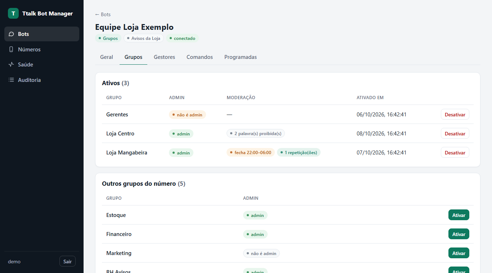
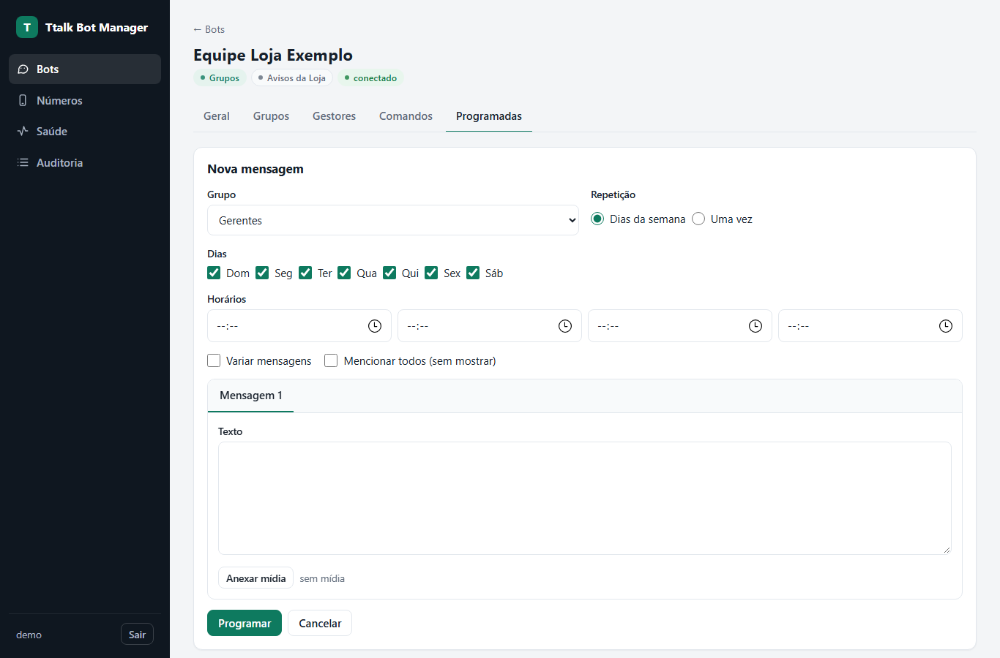
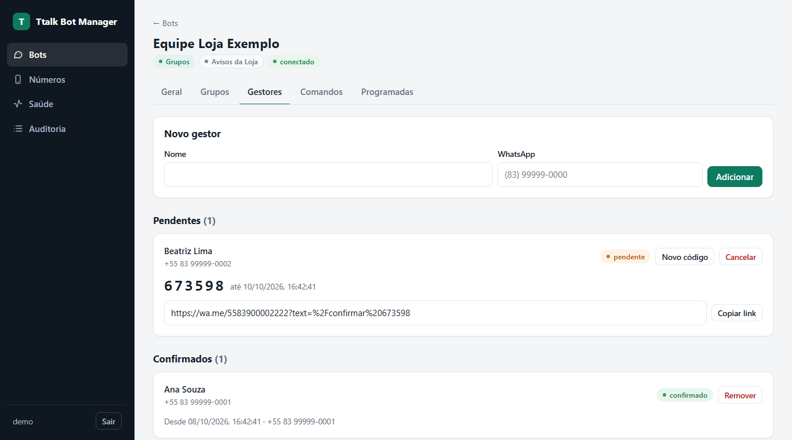
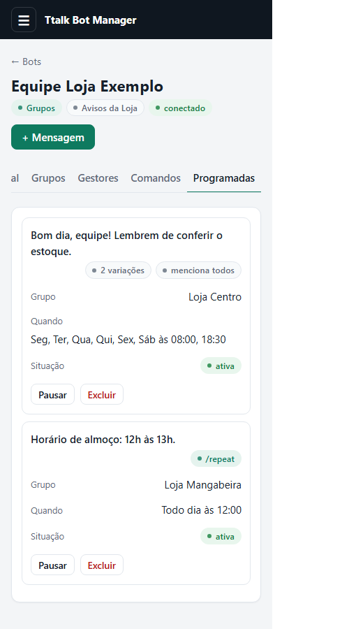

<div align="center">

# Ttalk Bot Manager

**Bots de WhatsApp auto-hospedados para pequenas empresas: um bot de recrutamento que recebe currículos e um bot de grupos que cuida dos grupos da empresa — tudo num painel web, no seu próprio servidor.**

[English](README.md) · [Começar](#começar) · [Comandos do bot de grupos](#comandos-do-bot-de-grupos) · [Anti-bloqueio](#anti-bloqueio) · [Operação](#operação)


</div>

---

Node.js 22 + TypeScript, Baileys `7.0.0-rc14` (versão fixada), SQLite e Fastify. Um processo só: sem navegador, sem Redis, sem PostgreSQL.

## Dois tipos de bot

### Bot de recrutamento

Um bot por vaga, criado no painel sem mexer em código.

- **Espera o candidato escrever primeiro** — nunca inicia conversa.
- Uma pergunta por mensagem: texto livre (pode conferir nome completo ou telefone) ou **enquete** do WhatsApp. Respostas digitadas como `2` ou `manhã` também valem.
- Termina recebendo **PDF, Word ou fotos**; fotos de várias páginas são agrupadas. Currículo mandado antes da hora é guardado, não perdido.
- Aguenta a vida real: áudio e figurinha, formato errado, arquivo grande demais, quem volta no dia seguinte, troca de currículo e número escondido (`@lid`).
- Entrada por link `wa.me` com o código da vaga, ou escrevendo direto para o número (com várias vagas abertas, o candidato escolhe numa enquete).
- Lista de candidatos, download dos arquivos e **exportação em ZIP (CSV + arquivos)** para a triagem.

### Bot de grupos

Um bot cuida dos grupos da empresa que você escolher, pelo próprio grupo ou pelo privado com ele.

- **Só age nos grupos ativados.** Nos outros fica em silêncio e não guarda nada.
- **O cadastro é só de gestores.** Você informa nome e WhatsApp; a pessoa só ganha poder depois de mandar um código de 6 dígitos (`/confirmar`) daquele mesmo WhatsApp. Código vindo de outro número fica para você conferir.
- **Os comandos valem no grupo e no privado.** No privado, o bot pergunta em qual grupo agir (lista numerada), executa lá e lembra a escolha para os próximos.
- **Mensagens programadas** por grupo: dias da semana ou uma data, até quatro horários por dia, até **três variações** (sorteadas, nunca a mesma duas vezes seguidas), foto, vídeo, áudio ou documento, e menção a todos sem aparecer.
- **Moderação**: palavras proibidas são apagadas sozinhas, o grupo pode ser fechado agora ou toda noite num horário, e participantes podem ser removidos por comando.
- Cada comando pode ser desligado por bot.

<div align="center">

</div>

## Comandos do bot de grupos

Só gestores confirmados usam; quem não é gestor não recebe resposta.

| Comando | No grupo | No privado (o bot pergunta o grupo) |
| --- | --- | --- |
| `/all mensagem` | Manda a mensagem mencionando todos **sem mostrar as menções** e apaga o comando do gestor | Manda no grupo escolhido; foto ou vídeo junto vai também |
| `/todos mensagem` | Igual, com todos os `@` aparecendo no texto | Igual, no grupo escolhido |
| `/mencionar mensagem @pessoa` | Manda a mensagem mencionando a pessoa em segredo | Use o telefone da pessoa no lugar do `@` |
| `/remove @pessoa …` | Remove participantes (nunca admins) | Telefones no lugar do `@` |
| `/banword palavra, outra` | Mensagens com essas palavras são apagadas. `/banword` lista, `/banword remover x` tira, `/banword limpar` zera | Igual, no grupo escolhido |
| `/mutegroup` · `/mutegroup 22:00/06:00` | Fecha o grupo (só admins falam) até o `/unmute`, ou todo dia nessa faixa | Igual |
| `/unmute` | Abre o grupo e cancela o horário | Igual |
| `/repeat 08:00 18:30` | Responda (cite) qualquer mensagem — texto ou mídia — e o bot repete todo dia nesses horários. Só `/repeat` pede a mensagem; `/repeat stop` para | Igual |
| `/menu` · `/grupo` | Lista os comandos | `/grupo` troca de grupo |

Remover, fechar o grupo e apagar mensagens exigem que o número do bot seja admin do grupo; o bot avisa quando não é. Menções funcionam de qualquer jeito.

## Painel

| Mensagem programada | Gestores |
| --- | --- |
|  |  |
| **Editor do bot de recrutamento** | **Candidatos** |
|  |  |
| **Número (QR)** | **No celular** |
|  |  |

- **Bots**: os de grupos e os de recrutamento na mesma lista. Cada bot de grupos tem as abas Geral, Grupos, Gestores, Comandos e Programadas.
- **Números**: cada número tem um uso só — *recrutamento* ou *grupos* —, assim um bloqueio num não derruba o outro. O número pode ser **pausado** (continua conectado, o bot não lê nem envia) ou **revogado** (o WhatsApp conectado sai e aparece um QR novo). O QR só roda com a tela do número aberta.
- **Saúde** (conexões, filas, backup), `/healthz` sem dados para monitores, e **Auditoria** de tudo que foi visto, exportado, mudado ou apagado.

## Anti-bloqueio

O WhatsApp bloqueia por **padrão de comportamento**. O Ttalk segue o que as ferramentas maduras (Evolution API, WPPConnect, whatsapp-web.js, os guias do Baileys) fazem:

- **Nunca inicia conversa.**
- **"Digitando" pareado com o tamanho do texto e sorteado** a cada mensagem, depois "parou de digitar", depois o envio.
- **Intervalos irregulares** entre mensagens e envios programados espalhados em até 45 s, nunca no segundo exato.
- **Tetos por minuto e por hora** por número, e freio de uma menção a todos por minuto em cada grupo.
- **Variação de mensagens** nas programadas.
- Lê antes de responder, guarda os dados dos grupos em cache, não fica "online" o tempo todo, não puxa histórico, não gera prévia de link, reconecta com espera crescente e para no logout.

Tabela completa com o porquê de cada medida: [docs/anti-bloqueio.md](docs/anti-bloqueio.md).

## Começar

```bash
git clone https://github.com/GustavoHuds/Ttalk_bot_manager.git && cd Ttalk_bot_manager
cp .env.example .env              # EMPRESA_NOME, PAINEL_SEGREDO, PAINEL_USUARIOS (e, se quiser, BACKUP_SENHA e SMTP)
npm install && npm run senha -- admin   # gera a linha para PAINEL_USUARIOS
mkdir -p data && sudo chown 1000:1000 data   # o container roda como uid 1000
docker compose up -d --build
```

`PAINEL_SEGREDO`: `node -e "console.log(require('crypto').randomBytes(32).toString('hex'))"`.

Abra `http://127.0.0.1:3100` e entre.

- **Recrutamento:** *Números* → abra *Principal* → leia o QR em WhatsApp → *Aparelhos conectados*. Depois *Bots* → **+ Bot de recrutamento**, preencha a vaga, **Abrir inscrições** e divulgue o link.
- **Grupos:** *Números* → **+ Número** com uso *Grupos* → leia o QR e coloque esse número nos grupos. Depois *Bots* → **+ Bot de grupos**, escolha o número, ative os grupos na aba **Grupos** e cadastre um gestor em **Gestores**. O gestor confirma mandando o código no privado do bot e depois manda `/menu`.

Em produção, publique o painel atrás de um proxy com HTTPS:

```caddyfile
bots.exemplo.com.br {
    reverse_proxy 127.0.0.1:3100
}
```

Sem Docker: `npm install`, `npm run dev` (use `PAINEL_COOKIE_SEGURO=false` sem HTTPS). Para conhecer o painel sem WhatsApp nenhum: `npx tsx scripts/previa-painel.ts` → `http://127.0.0.1:3199` (usuário `demo`, senha `demonstracao`).

## Criar um bot de recrutamento

1. *Bots* → **+ Bot de recrutamento** (ou **Copiar** num bot existente para reaproveitar perguntas e textos).
2. Vaga, código (vai no link e não muda depois), período e por quantos meses guardar os dados.
3. Perguntas: adicione, reordene e remova; cada uma é **texto livre** ou **enquete** (2 a 12 opções). O **currículo é sempre o último passo**: escolha os formatos e o tamanho máximo.
4. **Textos do bot** (opcional): em branco usa o padrão de `config/mensagens-padrao.yaml`. Variáveis: `{empresa}`, `{vaga}`, `{primeiro_nome}`, `{protocolo}`, `{retencao_meses}`.
5. **Salvar rascunho** ou **Abrir inscrições** — vale na hora, sem reiniciar.

Ciclo: rascunho → aberto (entre as datas) → encerrado. Depois do prazo de retenção, a rotina diária apaga candidaturas e currículos daquele bot. Bot com candidaturas não pode ser excluído, só encerrado.

## Operação

- **Se o celular desconectar o aparelho** (logout): o bot para aquele número e avisa por e-mail. Abra a tela do número: o QR novo aparece sozinho. A sessão antiga é copiada para `data/sessoes-antigas/` antes.
- **Uptime Kuma**: monitor HTTP em `/healthz` — 200 quando todos os números ativos estão conectados, 503 quando não, sem nenhum dado.
- **Backup**: com `BACKUP_SENHA`, todo dia às 3h sai `data/backups/backup-AAAA-MM-DD.tar.gz.enc` (banco, arquivos e sessões, AES-256-GCM). Copie a pasta para fora do servidor e guarde a senha fora também. Restaurar: `BACKUP_SENHA=... npm run restaurar-backup -- <arquivo> /tmp/restauro`.
- **Alertas**: com `SMTP_URL` e `ALERTA_EMAIL_PARA`, e-mail quando a conexão fica fora por mais de 10 min, quando a sessão é encerrada, quando volta e quando o backup falha.
- **Atualizar o Baileys**: copie `data/sessoes/`, troque a versão exata no `package.json`, `npm install`, `npm test`, e rode o fluxo completo num chip de teste antes de produção.

## Antes de colocar em produção

- [ ] Um chip dedicado por número, aquecido (1 a 2 semanas de uso normal), com perfil do WhatsApp Business completo.
- [ ] `ALERTA_EMAIL_PARA` e `BACKUP_SENHA` definidos.
- [ ] Recrutamento: piloto com 5 a 10 pessoas, Android e iPhone.
- [ ] Grupos: teste os comandos num grupo de teste, com o número do bot como admin.

## Desenvolvimento

```bash
npm test           # 228 testes
npm run typecheck
```

Veja [CONTRIBUTING.md](CONTRIBUTING.md).

## Licença

[MIT](LICENSE). Não é afiliado ao WhatsApp nem à Meta; usa uma conexão não oficial, e cumprir os termos do WhatsApp e a LGPD é responsabilidade de quem implanta.
